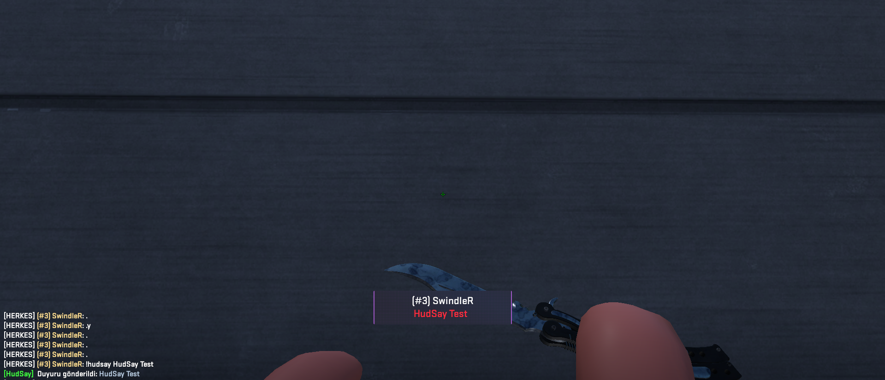

# 🔫 CS2 Plugin - [HudSay Plugin]

## 📌 Description

This plugin is a custom extension developed for Counter-Strike 2 servers. It offers the following features:

---

- ✅ Sends an announcement message to all players.
- ✅ Displays a large HudSay message in the center of the screen.

---

## 🧩 Requirements

- Counter-Strike 2 (dedicated server)
- CounterStrikeSharp

---

## 🛠️ Installation

### 1) Download the Plugin

- Download the latest release from:  
 👉 [Releases](https://github.com/SwindleR-b/CS2-HudSay/releases)

### 2) Install the Plugin

Place the plugin in the following directory:

_cs2/addons/counterstrikesharp/plugins/_

### 3) Start / Reload the Plugin

To activate:

- Restart your server  
  **OR**
- Run the following command in the server console:
css_plugins load HudSay

---

## ⚙️ Commands

| Command    | Description                      |
|------------|----------------------------------|
| `!hudsay`  | Sends a message to all players   |

---

## 📁 Configuration File
After restarting your server, a configuration file will be automatically generated at:

_cs2/addons/counterstrikesharp/config/plugins/HudSay/HudSay.json_

From this file, you can customize the general settings of the plugin according to your server needs.

---

## 📸 Screenshots

Here are some in-game screenshots of the plugin in action:

  

